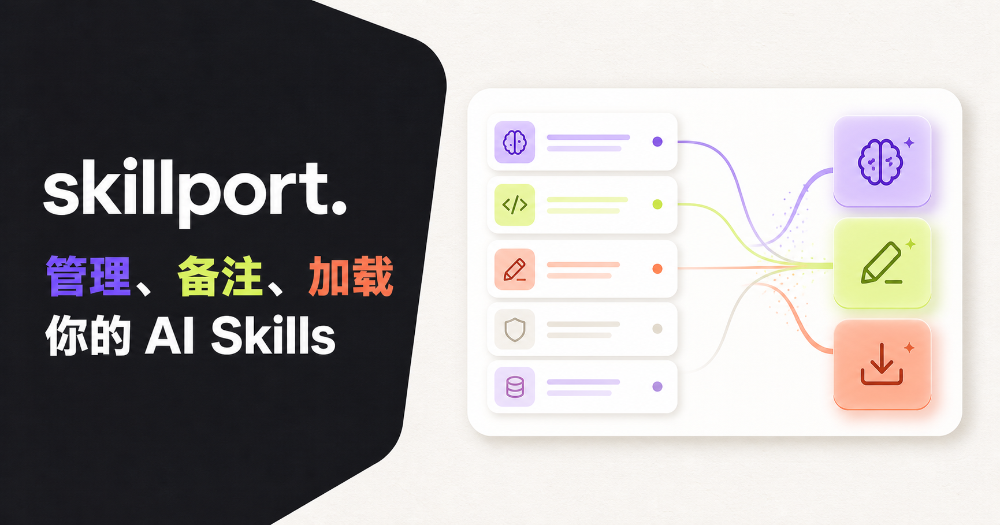
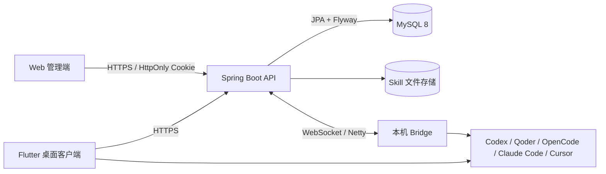

# SkillPort

跨平台的 AI Skill 管理、分享与本机分发平台。

[在线体验](https://www.jmuyuer.com) · [部署文档](deploy/README.md) · [Java 平台说明](java/README.md) · [Flutter 客户端说明](native/skillport_flutter_client/README.md)



## 功能特性

- **个人 Skill 空间**：按账号隔离 Skill 文件、名称、描述、分类、详细说明、使用步骤和个人备注。
- **Skill 公有池**：将自己的 Skill 分享到社区，或拉取其他用户分享的独立副本。
- **标准结构校验**：上传 `.zip`、`.skill` 或 `SKILL.md` 时检查目录结构、文件大小和 `SKILL.md`。
- **跨平台安装**：支持 macOS 与 Windows，可安装到 Codex、Qoder、OpenCode、Claude Code 和 Cursor。
- **本机工具识别**：按设备识别本地 AI 工具和 Skills 目录，避免不同电脑之间混用检测结果。
- **个人工作区**：在网页中按 AI 工具查看当前设备的本机 Skill、安装来源和实际目录，并区分“来自我的 Skill”与外部本地文件。
- **安全卸载**：只删除选定 AI 工具中的本机 Skill，不删除云端副本。
- **桌面客户端**：Flutter 客户端直接管理本机目录，不打开网页，也不依赖常驻 JAR。
- **浏览器 Bridge**：网页可通过设备配对和 Netty 长连接向本机 Bridge 下发安装或卸载任务。
- **账号与登录**：支持邮箱注册/登录，可选企业微信授权登录且首次登录自动注册。
- **界面能力**：内置多套主题、版本更新记录、公开意见墙和分页。

## 工作原理



浏览器受安全沙箱限制，不能直接写入用户的本机目录，因此网页版需要配对本机 Bridge。Flutter 桌面客户端拥有本机文件权限，可直接完成识别、安装和卸载，不需要常驻 Bridge JAR。

## 技术栈

| 模块 | 技术 |
| --- | --- |
| Web | React 19、TypeScript、Vite/vinext、Next.js API Routes |
| 云端服务 | Java 21、Spring Boot、Spring Data JPA、Flyway |
| 实时通信 | Netty WebSocket、HTTP Range、SHA-256 |
| 数据库 | MySQL 8 |
| 桌面客户端 | Flutter，支持 macOS 与 Windows |
| 部署 | K3s、Jib、Jenkins、Cloudflare Tunnel、Nginx |

## 项目结构

```text
.
├── app/                              # Web 页面、API 网关与会话处理
├── web-static/                       # 嵌入 Spring Boot 的静态 Web 入口
├── worker/                           # Sites/Worker 运行入口
├── java/
│   ├── skillport-server/             # Spring Boot、MySQL、Netty 服务端
│   ├── skillport-protocol/           # 服务端与 Bridge 的共享协议
│   └── skillport-bridge/             # 网页模式下的本机 Bridge
├── native/
│   ├── skillport_flutter_client/     # 当前 Flutter 桌面客户端
│   └── skillport-client/             # 早期原生客户端实现
├── deploy/                           # K3s、Nginx、Jenkins 与部署脚本
├── tests/                            # Web 和安装包结构测试
└── .github/workflows/                # Windows/macOS 客户端构建
```

## 标准 Skill 结构

推荐将一个 Skill 打包为以下结构：

```text
my-skill/
├── SKILL.md                          # 必需
├── scripts/                          # 可选
├── references/                       # 可选
└── assets/                           # 可选
```

ZIP 中可以直接包含 `SKILL.md`，也可以在唯一的顶层 Skill 目录中包含它。服务端会兼容 `SKILL.md` 文件名的大小写差异，但不接受缺少清单、目录穿越、符号链接或超出限制的压缩包。

## 快速开始

### 环境要求

- Node.js 22.13+
- JDK 21
- Maven 3.9+
- Docker（用于快速启动 MySQL）
- Flutter 3.47+（仅开发桌面客户端时需要）

### 1. 获取源码

```bash
git clone https://github.com/xsp664778130/wk-tmp.git
cd wk-tmp
```

### 2. 启动 MySQL

```bash
cd java
docker compose up -d mysql
cd ..
```

开发用 Compose 默认创建 `skillport` 数据库和本地测试账号。公开部署前必须替换全部默认密码和网关密钥。

### 3. 构建 Web 与 Java 服务

```bash
npm ci
npm run build:static

cd java
mvn clean package
java -jar skillport-server/target/skillport-server-1.0.0-SNAPSHOT.jar
```

打开 <http://localhost:8080>。Flyway 会在首次启动时自动创建数据库表。

如需连接自定义 MySQL、修改文件目录、启用企业微信登录或配置密码重置邮件，请参考 [`java/.env.example`](java/.env.example) 配置环境变量。不要提交真实 `.env` 文件。SMTP 必须使用邮件服务商生成的应用专用密码或授权码，不要填写邮箱登录密码。

### 4. 单独开发 Web

当 Java API 已运行在另一个地址时：

```bash
cp .env.example .env.local
npm ci
npm run dev
```

在 `.env.local` 中设置：

```dotenv
SKILLPORT_BACKEND_URL=http://localhost:8080
SKILLPORT_GATEWAY_KEY=与服务端一致的至少32位随机值
```

网关密钥仅供 Web 服务端调用 Java API，禁止写入浏览器代码或公开环境变量。

## 桌面客户端

```bash
cd native/skillport_flutter_client
flutter pub get
flutter analyze
flutter test
flutter run -d macos       # macOS
flutter run -d windows     # Windows
```

Flutter 桌面产物不能跨系统构建：macOS 安装包必须在 macOS 上生成，Windows EXE 必须在 Windows 上生成。仓库中的 GitHub Actions 会在对应系统构建并上传产物；创建 `flutter-client-v*` 标签时会生成 GitHub Release。

更多打包、安全存储和安装目录说明见 [`native/skillport_flutter_client/README.md`](native/skillport_flutter_client/README.md)。

## 测试

```bash
# Web 构建、安装器和页面契约测试
npm test

# Java 单元与集成测试（需要 JDK 21）
cd java
mvn test

# Flutter 静态检查与测试
cd native/skillport_flutter_client
flutter analyze
flutter test
```

## 部署

生产环境推荐使用 K3s：

```text
Git main
  → Web 测试和静态构建
  → Java 测试与打包
  → Jib 构建服务镜像
  → K3s Deployment 滚动更新
  → 健康检查，失败自动恢复
```

部署清单位于 [`deploy/k3s/`](deploy/k3s/)，完整说明见 [`deploy/README.md`](deploy/README.md)。生产密钥必须使用 Kubernetes Secret 或部署平台的 Secret 管理能力，不能提交到仓库。

## 安全设计

- 密码使用 BCrypt 哈希后保存，登录状态通过 HttpOnly Cookie 传递。
- Skill、设备、安装任务和个人备注均按用户 ID 强制隔离。
- 配对码和下载票据短期有效且只能在规定范围内使用。
- 下载完成后校验 SHA-256；解压时阻止绝对路径、`..` 和符号链接。
- 上传文件默认限制为 25 MB，解压内容限制为 100 MB。
- 数据库、Netty 和管理后台不应直接暴露到公网。
- 提交安全问题时请使用 GitHub Security Advisories，不要在公开 Issue 中披露漏洞细节。

## 参与贡献

1. Fork 仓库并从 `main` 创建功能分支。
2. 保持修改聚焦，并为行为变化补充测试。
3. 提交前运行相关的 Web、Java 或 Flutter 检查。
4. 创建 Pull Request，说明问题、实现方式和验证结果。

建议使用 Conventional Commits，例如：

```text
feat: add skill category filter
fix: persist public skill metadata
docs: improve local setup guide
```

## 开源许可证

当前仓库尚未添加 `LICENSE` 文件。公开 GitHub 仓库本身不会自动授予他人复制、修改或分发代码的权利。正式宣布开源前，请根据预期选择许可证；面向企业协作通常可考虑 Apache-2.0，追求简洁宽松可考虑 MIT。
